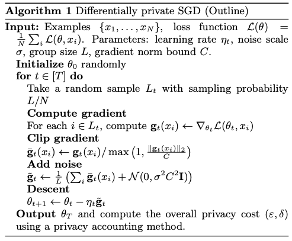
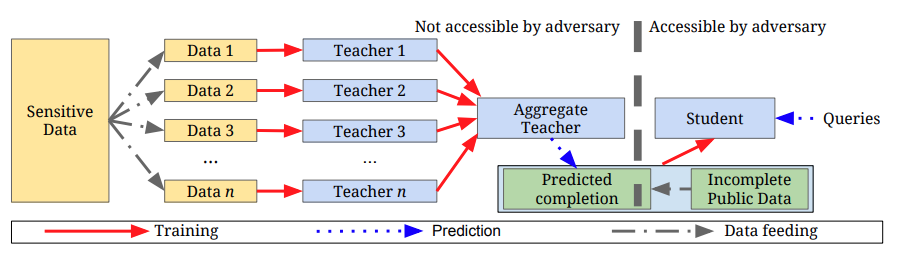

# Privacy Preserving Distributed Machine Learning

- [Preliminaries on Differential Privacy for Machine Learning](#_dp_for_ml)
- [Preliminaries on Distributions Metrics](#_metrics)
- [General Ideas of Differential Private Machine Learning](#_ideas_dp_for_ml)
- [Differential Privacy for Non-Deep Machine Learning](#_dp_for_ml_models)
- [Differential Privacy for Deep Learning](#_dp_for_dl)
- [Bibliography -- Distributed Private Learning](#_bib)

--- 

<a name="_dp_for_ml"/>

## Preliminaries on Differential Privacy for Machine Learning
We consider a randomized algorithm $`\mathcal{A}: \mathcal{D} \to \mathcal{R}`$ with domain $`\mathcal{D}`$ and range $`\mathcal{R}`$. <br>
We consider _input_ datasets $`D`$, $`D' \in \mathcal{D}`$ and call them adjacent, written $`D \sim D'`$ if they differ by one individual example. 


### Differential Privacy
A randomized algorithm $`\mathcal{A}`$ satisfies $`(\epsilon, \delta)`$-differential privacy (DP) if for any two adjacent inputs $`D, D' \in \mathcal{D}`$ and for any outcome $`\omega \in \mathcal{R}`$:

```math
	\Pr( \mathcal{A}(D) = \omega ) \leq 
	e^{\epsilon} \Pr( \mathcal{A}(D') = \omega ) + \delta,

```

where $`\epsilon`$ is the _privacy budget_ and $`\delta`$ is the _failure probability_.

#### Privacy Loss
The privacy loss $`L_{\mathcal{A}}`$ of  $`\mathcal{A}`$ for outcome $`\omega \in \mathcal{R}`$ and inputs $` x, x' \in \mathcal{X}`$ is:

```math
	L_{\mathcal{A}}(\omega, x, x') = \log 
	\frac{\Pr(\mathcal{A}(x) = \omega)}
		 {\Pr(\mathcal{A}(x') = \omega)}.

```


#### Standard Composition
The composition of an $`(\epsilon_1, \delta_1)`$-differentially private algorithms with an $`(\epsilon_2, \delta_2)`$-differentially private satisfies 
$`(\epsilon_1 + \epsilon_2, \delta_1 + \delta_2)`$-differential privacy.

#### Advanced Composition
For $`\epsilon, \delta, \delta' \geq 0 `$, composing _k_ $`(\epsilon, \delta)`$-differentially private algorithms satisfies $`(\epsilon', k\delta + \delta')`$-differential privacy under k-fold adaptive composition for 

```math
	\epsilon' = \sqrt{2k\ln(1/\delta')\epsilon} + k\epsilon(e^\epsilon - 1).

```


#### Secrecy of the Sample
Let $`\mathcal{A}`$ be an $`(\epsilon,\delta)`$-DP algorithm for datasets of size $`n`$. Consider $`\mathcal{A}'`$ a randomized algorithm that takes in input a dataset _D_ of size $`m \geq n`$, and runs  $`\mathcal{A}`$ on _D'_ obtained by uniformly subsampling _D_ _n_ times. Then $`\mathcal{A'}`$ is
$`(\epsilon', \delta')`$-differentially private for

```math
	\epsilon' = (e^\epsilon-1) (n/m) \qquad 
	\delta' = \delta (n/m).

```


#### Global Sensitivity
The sensitivity of a query $`Q`$ is its the maximal change in the output over all possible adjacent datasets $`D`$, $`D'`$:

```math
	\Delta_{Q} = \| Q(D) - Q(D')\|

```

where $`\|\cdot\|`$ is a norm, and we consider here it to be the $`\ell`$-2 norm.

#### Local Sensitivity
Given a dataset $`D`$, the _local sensitivity_ of a query $`Q`$ is defined as 

```math
	\Delta^L_{Q}(D) = \max_{D' : D \sim D'}  \| Q(D) - Q(D')\|

```

where $`D'`$ are the possible neighbors of $`D`$.
Publishing an answer using local sensitivity may leak information. For instance, if $`D`$ has small while $`D'`$ has large local sensitivity w.r.t. some query, the answer of the algorithm on $`D`$ would be very close to the original answer. 

<a name="_smooth_sensitivity"/>

#### Smooth Sensitivity
Smooth sensitivity overcomes this limitation by smoothing the scale of noise across neighboring datasets. 

Given a dataset $`D`$, and value $`\beta`$, the  $`\beta`$ _smooth sensitivity_ of $`Q`$ is defined as

```math
	\Delta^\beta_{Q}(D) = 
	\max_{\text{any dataset } \hat{D}} \left( 
		e^{-\beta \| D - \hat{D}\|} \Delta^L_{Q}(\hat{D})
		\right)

```

Smooth sensitivity reduces the amount of noise to inject to a query answer by avoiding the worst-case sensitivity. It allows publishing an $`(\epsilon, \delta)`$-DP query with noise that is determined not only by the query but also by the dataset itself. 

##### Smooth Sensitivity Framework
Given a query $`Q`$, let _d_ be the dimension of the sample space, and Gaussian noise $`Z \sim N(0,1)`$ the output

```math
	\tilde{Q}(D) = Q(D) + \frac{\Delta^\beta_{Q}(D)}{\alpha}

```

is $`(\epsilon, \delta)`$-DP, for $`\alpha = \frac{\epsilon}{\sqrt{ln(1/\delta)}}`$ and $`\beta = \Omega(\frac{\epsilon}{\sqrt{d ln(1/\delta)}})`$.

###### Notes and Links:
- [Slides including a good description of smooth sensitivity](https://www.cs.cmu.edu/afs/cs/usr/wing/www/class/15-895/AvrimBlum.pdf)


<a name=_realxed_DP/>

### Relaxation of Differential Privacy
The linear composition bound on $`\epsilon`$ can be reduced at the cost of slightly increasing the failure probability $`\delta`$. This relaxation considers the _expected_ privacy loss, rather than the _worst-case_ loss. <br>
In turn, relaxation of differential privacy mechanisms can be defined to bound the _expected_ privacy loss in order to achieve better utility. 

<a name=_CDP/>

#### Concentrated Differential Privacy (CDP)
The composition of multiple differentially private algorithms result in expected privacy loss which follows a _subgaussian distribution_. The, the expected privacy loss can be directly bounded by controlling the mean and the variance of the subgaussian distribution. This reduces the noise that should be added. 

A randomized algorithm $`\mathcal{A}`$ is $`(\mu, \tau)`$-concentrated differentially-private if for all pairs of adjacent datasets $`D, D'`$,

```math
	D_{\text{subG}} (\mathcal{A}(D) \| \mathcal{A}(D')) \leq (\mu, \tau)

```

where the subgaussian divergence $`D_{\text{subG}}`$, is defined such that the expected privacy loss is bounded bu $`\mu`$ and the standard deviation of the centered subgaussian distribution is bounded by $`\tau`$. 

Any $`\epsilon`$-DP algorithm satisfies $`(\epsilon \cdot (e^\epsilon -1) / 2, \epsilon)`$-CDP, however the converse is not true.

<a name=_zCDP/>

#### Zero Concentrated Differential Privacy (zCDP)
Is a variation on CDP that assumes the expected privacy loss to be tightly centered around zero mean. <br>
A randomized algorithm $`\mathcal{A}`$ is $`(\xi, \rho)`$-zero-concentrated differentially private if, for all adjacent datasets $`D, D'`$ and all $`\alpha \in (1, \infty)`$,

```math
	D_{\alpha} (\mathcal{A}(D) \| \mathcal{A}(D')) \leq \xi + \rho\alpha

```

where $`D_{\alpha} (\mathcal{A}(D) \| \mathcal{A}(D'))`$ is the $`\alpha`$-Renyi divergence between the distribution of $`\mathcal{A}(D)`$ and that of $`\mathcal{A}(D')`$.

If $`\mathcal{A}`$ satisfies $`\epsilon`$-DP, then it also satisfies $`(\frac{1}{2}\epsilon^2)`$-zCDP. Additionally, if $`\mathcal{A}`$ satisfies $`\rho`$-zCDP, then it is $`(\rho, 2\sqrt{\rho \log(1/\delta)}, \delta)`$-DP, for any $`\delta > 0`$.

<a name=_RDP/>

#### Renyi Differentially Privacy (RDP)
A randomized algorithm $`\mathcal{A}`$ is said to have [$`\epsilon`$-Renyi differential privacy](#Mironov:17) of order $`\alpha`$--said $`(\epsilon, \alpha)`$-RDP, for short--, if for any adjacent dataset $`D, D'`$:

```math
	D_\alpha(\mathcal{A}(D) \| \mathcal{A}(D')) \leq \epsilon.

```

If  $`\mathcal{A}`$ is an $`(\alpha,\epsilon)`$-RDP algorithm, then it also satisfies $`(\epsilon + \log\frac{1}{\delta}, \delta)`$-DP for any $`0<\delta<1`$.

<br>
The main difference among these relaxation is that CDP and zCDP require a linear bound on all positive moments of privacy loss, whereas RDP only requires bounding one moment at a time. This enables a more accurate numerical analysis of the privacy loss. 

###### Notes and Links:
- [Paper on KL vs Renyi divergence](https://arxiv.org/pdf/1206.2459.pdf)

<a name=_moments_accountant/>

#### Moments Accountant (MA)
The [_moments accountant_](#Abadi:16) bounds the expected privacy loss of a differentially private algorithm. It does so by bounding the higher order moments of the privacy loss random variable. It is derived by the following work [Bun:16](#Bun:16), [Dwork:16a](#Dwork:16), [Mironov:17](#Mironov:17). 
This technique is recurrent in privacy preserving deep learning. 

The moment of accountant is defined as

```math
	\alpha_{\mathcal{A}}(\lambda) 
	{\stackrel{\Delta}{=}} \max_{\text{aux}, D, D'} 
	\alpha_{\mathcal{A}} (\lambda; \text{aux}, D, D'),

```

where $`\text{aux}`$ is just an auxiliary input to the mechanism and 

```math
	\alpha_{\mathcal{A}} (\lambda; \text{aux}, D, D')
	{\stackrel{\Delta}{=}}
	\log \mathbb{E}\left[
		\exp( \lambda L(\mathcal{A}, \text{aux}, D, D'))
	\right]

```

is the [moment generating function](https://newonlinecourses.science.psu.edu/stat414/node/72/) 
of the _privacy loss random variable_ $`L(\mathcal{A}, \text{aux}, D, D') `$. The latter is in turn defined as $`L_{\mathcal{A}}(\mathcal{A}(D); D, D'`$, i.e., the random variable defiend by evaluating the privacy loss at an outcome sampled from $`\mathcal{A}(D)`$. 

The following properties of the moment accountant hold: 
- <strong>Composability</strong>: 
Consider a mechanism $`\mathcal{A}`$ that consists of a sequence of adaptive mechanisms $`\mathcal{A}_{1}, \ldots, \mathcal{A}_{k}`$ where $`\mathcal{A}_{i} : \prod_{j=1}^{i-1} \mathcal{R}_{j} \times \mathcal{D} \to \mathcal{R}_{i}`$. Then, for any output sequence $`o_1, \ldots, p_{k-1}`$ and any $`\lambda`$

```math
	\alpha_{\mathcal{A}}(\lambda; D, D') = 
	\sum_{i=1}^k \alpha_{\mathcal{A}_{i}} (\lambda; o_1, \ldots, o_{i-1}, D, D'),

```

where $`\alpha_{\mathcal{A}}`$ is conditioned on $`\mathcal{A}_{i}`$' output being $`o_i`$_ for $`i < k`$. 
This property is proved in [Dwork:14](#Dwork:14).
- <strong>Tail bound</strong>: 
For any $`\epsilon >0`$, the mechanism $`\mathcal{A}`$ is $`(\epsilon, \delta)`$-differentially private for:

```math
	\delta = \min_{\lambda} \exp( \alpha_{\mathcal{A}}(\lambda) - \lambda \epsilon ).

```

The above is proven in [Bun:16](#Bun:16).

It has been noted that the moments accountant can be considered as an instance of Renyi differential privacy. 

###### Notes and Links:
- [Additional info on Moment generating function](https://www.probabilitycourse.com/chapter6/6_1_3_moment_functions.php) 


#### References 
- <a name="Dwork:14"/> 
  [The algorithmic foundations of differential privacy](https://www.cis.upenn.edu/~aaroth/Papers/privacybook.pdf) 
  (Foundations and Trends in Theoretical Computer Science, 2014).
- <a name="Bun:16"/> 
  [Concentrated differential privacy: simplifications, extensions, and lower bounds](https://arxiv.org/pdf/1605.02065.pdf) (TCC 2016).
- <a name="Dwork:16"/> 
  [Concentrated differential privacy](https://arxiv.org/pdf/1603.01887.pdf) (arXiv 2016).
- <a name="Mironov:17"/> 
  [Renyi differential privacy](https://arxiv.org/pdf/1702.07476.pdf) (manuscript, 2017).

---
<a name="_metrics"/>

### Preliminaries on Distributions Metrics

We review some important metrics to measure distance between distributions. 

#### KL-Divergence
The _KL-Divergence_ (or _relative entropy_) between two random variables _Y_ and _Z_ taking values from the same domain is:

```math
	D(Y \| Z) = \mathbb{E}_{y \sim Y} \left[
	\ln \frac{\Pr(Y = y)}{\Pr(Z = y)} \right],

```

We have that $`D(Y \| Z) \geq 0`$, with equality iff _Y_ and _Z_ are identically distributed. Note that _D_ is not symmetric, and does not satisfy the triangle inequality. 

#### Max Divergence 
The _Max Divergence_ between two random variables $`Y`$ and $`Z`$ taking values from the same domain is:

```math
	D_{\infty}(Y \| Z) = \max_{S \subseteq \text{Supp}(Y)}
	\left[
		\ln \frac{Pr(Y \in S)}{Pr(Z \in S)}
	\right].

```


The $`\delta`$-approximate Max Divergence between $`Y`$ and $`Z`$ is:

```math
	D^{\delta}_{\infty}(Y \| Z) = \max_{S \subseteq \text{Supp}(Y) : 
										   \Pr(Y\in S) \geq \delta}
	\left[
		\ln \frac{Pr(Y \in S) - \delta}{Pr(Z \in S)}
	\right].

```


#### Statistical Distance
The _Statistical Distance_ between two random variables $`Y`$ and $`Z`$ is

```math
	\Delta(Y, Z) = \max_S 
	\left| 
		\Pr(Y \in S) - \Pr(Z \in S)
	\right|

```

_Y_ and _Z_ are $`\delta`$-close  if $`\Delta(Y, Z) \leq \delta`$.

#### Relation to Differential Privacy
Note that an algorithm $`\mathcal{A}`$ is
- $`\epsilon`$-differentially private if on every two neighboring databases $`x`$ and $`y`$, 

```math
	D_{\infty}(\mathcal{A}(x) \| \mathcal{A}(y)) \leq \epsilon 
	\qquad \text{and} \qquad
	D_{\infty}(\mathcal{A}(y) \| \mathcal{A}(x)) \leq \epsilon.

```

- $`\epsilon, \delta`$-differentially private if on every two neighboring databases $`x`$ and $`y`$, 

```math
	D_{\infty}^{\delta}(\mathcal{A}(x) \| \mathcal{A}(y)) \leq \epsilon 
	\qquad \text{and} \qquad
	D_{\infty}^{\delta}(\mathcal{A}(y) \| \mathcal{A}(x)) \leq \epsilon.

```


#### TODO: 
- [ ] Add Renyi divergence


---
<a name="_ideas_dp_for_ml">

### General Ideas of Differential Private Machine Learning

Several general directions have been investigated to create differential privacy machine learning algorithms.

#### Input Perturbation
The most straightforward way to guarantee differential privacy is to perturb the input data. If $`x`$ is a d-dimensional vector, then a differentially private version of $`x`$ is constructed by adding noise to it from a random d-dimensional vector $`Z`$ with density:

```math
	p_Z(z) \propto \exp \left( -\frac{\epsilon}{2} \| z\| \right).

```

This method can be used to construct a noisy histogram to estimate the density function of the data. The noisy, private, data can be used as input to the desired machine learning algorithm. (See [33, 26] of [Ji:14](#Ji:14)).

#### Output Perturbation
Suppose we want to compute a function $`f`$ over a dataset D. Output perturbation algorithms first learn the model using the clean data, hence apply noise directly to the output of the function $`f`$, generating a noisy estimate 
$`
	\hat{f}(D) = f(D) + Z
`$, 
where $`Z`$ is a d-dimensional random vector with density 

```math
	p_Z(z) \propto \exp \left( -\frac{\epsilon}{\Delta_f} \| z\| \right).

```

and $`\Delta_f`$ is the sensitivity of the function $`f`$. 

Typical algorithms apply the Laplace or the Exponential mechanism on the output parameters of the model (e.g., [52, 40, 46, 28, 30, 7, 53] of [Ji:14](#Ji:14)).

The methods that apply noise to the output parameters at each iteration during the training process (e.g., [21, 31, 24, 19, 25, 41, 55] of [Ji:14](#Ji:14)) apply to this category as well.

#### Objective Perturbation 
Objective perturbation methods introduce noise to the objective function of the optimization/learning process. These methods require bounding the sensitivity of the function to approximate  (e.g., [56, 5, 6, 45] of [Ji:14](#Ji:14)). 
This strategy was applied to regularized convex classification. In other words, given a non-private algorithm computing output _f_ via a minimization of a (strongly) convex function $`J(g, D)`$, we can produce a differentially private algorithm by adding noise prior to minimization:

```math
	f = \arg\min_h \left( J(u, D) + g^T Z \right),

```

where $`Z`$ has the same shape as in that of the input perturbation but the coefficient in the exponent must be chosen as a function of the sensitivity of the optimization. <br>


#### Sample-and-Aggregate 
In objective perturbation, in general, the coefficient depend on the target function _f_ that we want to approximate but not on the actual data _D_. 
The sample-and-aggregate method tries to relax this restriction by approximating the function value on subsets of the actual data. 
The general method works by partitioning the dataset into small subsets to estimate a model, then adding noise to an aggregation step [42,27,14] of [Ji:14](#Ji:14).

Most output and objective perturbation mechanisms require a bounded sample space to compute a bounded sensitivity. Mechanisms based on the sample-and-aggregate framework don’t have this limitation. However they guarantee $`\epsilon, \delta`$-differential privacy. 
When the sample space is unbounded one can guarantee $`\epsilon`$-differential privacy by truncating values in a pre-processing step. If the truncation mechanism is independent of the private data, then the truncation is
privacy-safe.


--- 
<a name="_dp_for_ml_models">

## Differential Privacy for Non-Deep Machine Learning

#### Naive Bayes Model
We want to build a classifier that predicts a label Y given feature X. Given X and a model, one can compute the conditional probability $`\Pr(Y|X)`$ for all labels Y and choose the label with the largest conditional probability value.

There are two main assumptions:
1. The $`X_{i}`$ are conditionally independent given $`Y`$ , i.e.,
$`\Pr(X_{i} |Y, X_{1}, \ldots, X_{i-1}, X_{i+1}, \ldots, X_{n}) = \Pr(X_{i}|Y) `$. This enables us to compute the coefficient of each feature independently. 
2. Tor all numerical features in $`x`$, $`\Pr(X_{i} |Y)`$ is a normal distribution.

Based on (1) we have that:

```math
	\Pr(Y | X_1, \ldots, X_n) \propto \Pr(Y) \prod_{i=1}^n P(X_i | Y) 

```

The model can be thus trained by estimating all the $`\Pr(Y`$ and the $`\Pr(X_i | Y`$. The former can be estimated by the frequencies of samples with label $`Y`$ in the training set. For the latter, if $`X_i`$ is categorical, then for values $`x`$ and $`y`$:

```math
\begin{align*}
	\Pr(X_i = x | Y = y) &= \frac{\Pr(X_i=x, Y=y)}{\Pr(Y=y)} \\
 	                     &= \frac{\sum_j \text{ct}(x_{ij} = x) \text{ct}(y_i = y)}
	                            {\sum_j \text{ct}(y_i =y)}.
\end{align*}

```

where ct counts the number of elements $`x_ij`$ taking on value $`x`$. 
If $`X_i`$ is numeric, then by (2), the Normal distribution $`\Pr(X_i | Y)`$ is decided by $`E[X_i | Y]`$ and $`Var[X_i | Y]`$. 

To guarantee $`\epsilon`$-differential privacy, [Vaidya:13](#Vaidya:13) assumes that the value of all features in the dataset can be bounded by some known value. This bound is used to compute the model sensitivity and add noise with Laplace mechanism with parameter $`O(1/n\epsilon)`$.

##### References

- <a name="Vaidya:13"> [Differentially private naive Bayes classification](https://ieeexplore.ieee.org/document/6690067) (IAT 2013).


#### Linear Regression
In linear regression one wants to express numerical values $`Y`$ as weighted combination $`\omega X`$ of the features in $`X`$. The training solves:

```math
	\min_\omega \sum_i (y_i - \omega^T x_i)^2.

```


The *functional mechanism* is a differential privacy model for linear regression that was proposed in [Zhang:12](#Zhang:12). It expands the above expression using Taylor expansion, approximates it with a low degree polynomial, and add noise to its coefficients to guarantee privacy.

#### Logistic Regression 
Logistic regression is a model for binary classification. It predicts $`\Pr(Y = 1 \ X) = \frac{1}{1 + e-{\omega^T X}}`$ given features X in a sample. 
The parameters $`\omega`$ are trained by:

```math
	\min_\omega \sum_i \log (1 + \exp(-y_i \omega^T x_i)).

```

In [Zhang:12](#Zhang:12), the functional mechanism, that uses Taylor expansion, is applied to achieve an $`\epsilon`$-differential private algorithm for logistic regression.<br>
Two additional mechanisms that can ensure $`\epsilon`$-differentially private models are the _output perturbation_ and the _objective perturbation_ mechanisms, described in [Chaudhuri:12a](#Chaudhuri:12a).

#### Kernel SVM

##### References

- <a name="Zhang:12"/> 
[Functional Mechanism: Regression Analysis under Differential Privacy](http://vldb.org/pvldb/vol5/p1364_junzhang_vldb2012.pdf) (VLDB 2012).
- <a name="Chaudhuri:12a"/> 
[Differentially private empirical risk minimization](http://www.jmlr.org/papers/volume12/chaudhuri11a/chaudhuri11a.pdf) (JMLR 2012).


#### Decision Tree Learning
Decision tree learning works by iteratively partitioning the dataset selecting a variable with an associated _split value_. The process creates a tree, by construction, where the path from the tree root to a node describes a partition of the data, containing values satisfying all the decision rules in the traversed nodes.

The work by [Jagannathan:10](#Jagannathan:10) constructs an $`\epsilon`$-differential private decision trees by randomly constructing a tree (i.e., it randomly selects splitting rules until a given tree depth is reached) thus without looking at the data. Each decision tree induces a partition over the data and counts the number of elements in each partition that have a given label. 
The resulting counts are perturbed using a Laplace mechanism and used to estimate the probability of label y in each tree leaf.

[Friedman:10](#Friedman:10) proposed an $`\epsilon`$-differential private mechanism for tree that relies on the use of the Exponential mechanism to select the variable with largest score (e.g., information Gain, Gini index) differentially privately. 
For each partition, induced by the process, it assigns a noisy count of samples with each label. These noisy counts are hence used to decide whether to remove those nodes without having to consider privacy. 
To avoid selecting a split value for a feature, the mechanism assumes that all features are categorical. 

##### References 
- <a name="Jagannathan:09"/> [A practical differentially private random decision tree classifier](http://www.tdp.cat/issues11/tdp.a082a11.pdf) (ICDM 2009).
- <a name="Friedman:10"/> [Data mining with differential privacy](http://www.cs.technion.ac.il/~arikf/online-publications/DiffPDataMining10.pdf) (ICKDDM 2010).
	

#### Online Convex Programming
Focuses on solving convex programming problems in an online manner, by analyzing examples one at a time. 
The input is a sequence of functions $`(f_1, \ldots, f_T)`$ and the output is a sequence of points $`w_1, \ldots, w_T`$ from a convex set $`C`$. 
The algorithm starts at a random point $`w_0`$ and at each step _i_ it finds a new output $`w_{i+1} \in C`$ using $`(f_1, \ldots, f_i)`$ and $`(w_1, \ldots, w_i)`$. The goal of online convex programming is to minimize _regret_:

```math
	R = \sum_{i=1}^T f_i(w_i) - \min_{w\in C} \sum_{i=1}^T f_i(w).

```


The work of [Jain:12](#Jain::12) provides an $`(\epsilon, \delta)`$-differentially private method for the Implicit Gradient Descent (IGD) and for the Generalized Infinitesimal Gradient Ascent (GIGA). It assumes that the $`f_i`$ functions are L-Lipshitz continuous for some constant L and $`\eta`$-strongly convex. 

IGD computes:

```math
	\hat{w}_{i+1} = \arg\min_{w \in C} \left(
		\frac{1}{2} \| w - w_i\|^2 + \frac{1}{\eta i} f_i(w)
	\right),

```

and projects $`\hat{w}_{i+1}`$ onto $`C`$ to get the output $`w_{i+1}`$. 

GIGA computes

```math
	\hat{w}_{i+1} = w_i - \frac{1}{\eta i} \nabla f_i(w_i),

```

and then $`\hat{w}_{i+1}`$ onto $`C`$ to get the output $`w_{i+1}`$. <br>
Both methods ensure bounded sensitivity of $`w_{i+1}`$ given $`w_i`$. To guarantee privacy, the mechanism adds Gaussian noise to every $`\hat{w}_i`$ 
before projection. Given T function (or samples), the expected regret attained by this $`\epsilon, \delta`$-differentially private mechanism is $`O(\sqrt{\frac{t}{\epsilon}} \ln^2 \frac{T}{\delta} )`$._


#### Feature Selection
The foal of feature selection is to produce a dimensionality reduction from a high-dimensional dataset in which only a subset of the original features from the original feature space is retained.

The work in [Staal:12](#Staal:12) proposes an $`\epsilon`$-differentially private method for feature selection. For any feature set _S_, it defines a function _F(S)_ that tells how many pairs of samples from different classes  can the features in S distinguish. 
The algorithm starts with an empty set _S'_ of slected features. It hence greedily selects the feature leading to the largest increase of _F(S')_ using the exponential mechanism. 
The above assumes that all features are categorical. 

[Smith:13](#Smith:13) propose an $`(\epsilon, \delta)`$-differentially private algorithm for _stable_ target function. A stable function is one whose either (a) value does not change when it takes in input a dataset D or a dataset D' with some samples change, or (b) the function output stay the same, with high probability, on a random subset of the input dataset. 
For the first kind of functions, the mechanism uses the [smooth sensitivity](#smooth_sensitivity) framework to select features. For the second kind of functions, the algorithm uses a similar framework to that of the sample-and-aggregate framework: It creates some bootstrap set from the private data, selects the features non-privately on each set, and counts the frequencies of feature set output by the algorithm. The mechanism can release the most frequently selected set of features. 

##### References
- <a name="Staal:12"/> [Differentially private projected histograms: Construction and use for prediction](https://link.springer.com/chapter/10.1007/978-3-642-33486-3_2) (ECML 2012) 
- <a name="Smith:13"/> [Differentially Private Feature Selection via Stability Arguments, and the Robustness of the Lasso](https://pdfs.semanticscholar.org/c2fa/a587bd3b7ebddbafdb310b201382d106f8ec.pdf) (PMLR 2013)


#### Principal Component Analysis
Is a dimensionality reduction technique based on a matrix factorization. It learns a linear projection of the original dataset into a lower-dimensional one. The new representation explains as much of the variance in the original dataset as possible. 

Differential private PCA algorithms include [Chaudhuri:12b](#Chaudhuri:12b), [Hardt:12](#Hardt:12), and [Kapralov:13](#Kapralov:13).

##### References
- <a name="Chaudhuri:12b"/> Near-optimal differentially private principal components(https://papers.nips.cc/paper/4565-near-optimal-differentially-private-principal-components) (NIPS 2012).
- <a name="Hardt:12"/> Beyond worst-case analysis in private singular vector computation(https://arxiv.org/pdf/1211.0975.pdf) (In Computing Research Repository, 2012).
- <a name="Kapralov:13"/> On differentially private low rank approximation(https://theory.epfl.ch/kapralov/papers/dp.pdf) (ACM-SIAM Symposium on Discrete Algorithms, 2013).


#### Robust Statistical Estimators

#### Point Estimator

#### M-estimator

#### Data Release Scheme for Learning
Data Release mechanisms can be categorized into:
1. Those that partition the sample space using the Exponential mechanism and then add noise to the counts (e.g., by using Laplace).
2. Those that generate noisy histograms using Laplace and then partition the space based on such counts.

##### References

<a name="Jain:12"/>

- Differentially private online learning. (COLT 2012) 
	[[Paper]](http://proceedings.mlr.press/v23/jain12/jain12.pdf)

--- 
<a name="_dp_for_dl">
	
## Differential Privacy Deep Learning

### Private Stochastic Gradient Descent
[Abadi et al.](#Abadi:16) presented an approach to train neural networks based on a differentially private stochastic gradient descent and the use of the [moments accountant](#_moments_accountant). 


The private SGD is illustrated in the algorithm on the right. It illustrates how to train a model with parameter $`\theta`$ by minimizing the empirical loss function $`\mathcal{L}(\theta))`$. 
At each step of the SGD, it computes the gradient $`\nabla_\theta \mathcal{L}(\theta, x_i`$ for a sample batch, clip the $`\ell_2`$ norm of each gradient, compute the average, add noise to guarantee privacy, and take a step in the opposite direction of this average noisy gradient. 

- _Clipping_: Guaranteeing DP requires to bound the influence of each individual example on the gradient. Since there is no a priori bound on the size of the gradients, the methods _clips_ each gradient in $`\ell_2`$ norm using a threshold $`C`$. 

- _Noise addition_: Note that, in this algorithm $`\theta`$ subsumes all the model parameters of the loss function $`\mathcal{L}(\cdot)`$. For multi-layer Nets we need to consider each layer separately. This also allows one to select different clipping thresholds _C_ and noise scales $`\sigma`$ for each layer.


- _Accounting_: Choosing $`\sigma = \sqrt{2 \log \frac{1.25}{\delta}/ \epsilon}`$ will derive $`\epsilon, \delta`$-DP at each step. One could use advanced composition to derive a $`O(q\epsilon), q\delta`$-DP algorithm with respect to a dataset where $`q = L/N`$ is the sampling ratio per lot (a batch) and $`N`$ the dataset size, with $`\epsilon < 1`$. 
The work, however, introduced a the moments accountant to derive a $`O(q\epsilon \sqrt{T}), \delta`$ bound where _T_ is the number of iterations of the algorithm. The paper show (Thm. 1) that, exists $`c_1, c_2 \in \mathbb{R}`$ such that given the sampling probability $`q=L/N`$ and the number of steps $`T`$, for any $`\epsilon < c_1 q^2 T`$, the algorithm above is $`\epsilon, \delta`$-differentially private for any $`\delta > 0`$ with 

```math
	\sigma \geq c_2 \frac{q \sqrt{T \log(1/\delta)}}{\epsilon}.

```

The saving are significant. For example, with $`L = 0.01N, \sigma = 4, \delta =
10^{−5}`$
, and $`T = 10000`$, moments accountant produces $`\epsilon \sim 1.26 `$, while strong composition produces $`\epsilon = 9.34`$.


### The PATE Framework 
[PATE](#) is a framework that protects privacy of the training data during learning. 

It uses an ensemble of _teacher models_, each trained on partitions of the data, and transfer their knowledge to a _student model_, that learns while guaranteeing differential privacy.
<p align="center">
	
</p>
PATE has tree components, as illustrated in the Figure above:

1. <strong>Teacher Models</strong>: Each teacher is trained independently on a subset of the data, forming a partition among all teachers. 
A teacher model can be *any* learning model. It does not have to be private either. At inference, teachers independently predict labels.

2. <strong>Aggregation Mechanism</strong>: The aggregation mechanism assigns a labels to data points using the predictions from the teacher ensemble. To guarantee privacy, the mechanism uses Noisy Max and outputs the class with the highest noisy votes as the ensemble's prediction. 
This step assumes that the privacy loss of each aggregated prediction made by the teacher ensemble is known. 

For sample $`x`$ and classes $`1,\ldots,m`$, let $`f_j(x) \in [m]`$ denote the _j_-th model's prediction and let $`n_i`$ denote the vote count for the _i_-th class. The mechanism outputs $` \arg\max_i n_i(x) + \text{Lap}(1/\lambda)`$. 

While this model guarantee privacy it faces two limitations: First, each prediction made by the aggregation mechanism increases the total privacy budget. Second, the ensemble cannot be made public. To overcome these limitations, a student model is introduced.

3. <strong>Student Model</strong>: The final step involves training a student model by knowledge transfer from the teacher ensemble using access to public--but _unlabeled_--data. 
The student selects inputs from a set of unlabeled public data and submits these inputs to the teacher ensemble to have them labeled. The noisy aggregation mechanism responds with private labels, which the student uses to train a model. PATE executes a limited number of queries during training and uses the moment accountant to asses tight privacy losses. The student sees exclusively public data and privacy-preserving labels.


The student model can be formulated as a Generative Adversarial Network, which learns the data 


##### References

- [PATE Blog](https://www.cleverhans.io/privacy/2018/04/29/privacy-and-machine-learning.html)

<a name="r_Song:13"/> 

- Stochastic gradient descent with differentially private updates (GlobalSIP 2013)


---
### TODO: Review of Differential Privacy Algorithms
- [ ] The sparse vector technique
- [ ] SmallDB
- [ ] Subsample and aggregate
- [ ] Propose-test-Release
- [ ] Private Multiplicative Weights
- [ ] Boosting for Queries


---  
<a name="_bib"/>

## Bibliography

### Attacks on Privacy-Preserving Machine Learning Models

- <a name="Shokri:17"/> 
  [Membership inference attacks against machine learning models](https://www.cs.cornell.edu/~shmat/shmat_oak17.pdf) (SP 2017) 
  [[info]](private_DML_bib.md#Shokri:17)<br>
  <strong>Tags:</strong> Adversarial ML | Black box ML | Membership
<!--  -->
- <a name="Hitaj:17"/> 
  [Deep Models Under the GAN: Information Leakage from
Collaborative Deep Learning](https://arxiv.org/pdf/1702.07464.pdf) (CCS 2017)
	[[info]](private_DML_bib.md#Hitaj:17)<br>
	<strong>Tags:</strong>: Federated Learning Risks | GAN | DP ineffectiveness
<!--  -->
- <a name="Fredrikson:15"/> 
  [Model inversion attacks that exploit confidence information and basic countermeasures](https://www.cs.cmu.edu/~mfredrik/papers/fjr2015ccs.pdf) (CCS 2015)
  [[info]](private_DML_bib.md#Fredrikson:15)<br>
  <strong>Tags:</strong> Model inversion | decision trees | neural nets
<!--  --> 
- <a name="Fredrikson:14"/> 
  [Privacy in Pharmacogenetics: An End-to-End Case
Study of Personalized Warfarin Dosing](https://www.usenix.org/system/files/conference/usenixsecurity14/sec14-paper-fredrikson-privacy.pdf) (USENIX 2014)
  [[info]](private_DML_bib.md#Fredrikson:14)<br>
  <strong>Tags:</strong> Model inversion | medical | DP | LR | Histograms | Negative result for DP


### Secure Multi-party Computation

- <a name="Blanton:18"/> 
  [Privacy Preserving Analytics on Distributed Medical Data](https://arxiv.org/pdf/1806.06477.pdf) (ArXiv 2018)
  [[Info]](private_DML_bib.md#Blanton:18) <br>
  <strong>Tags:</strong> MPC | Health
<!--  -->
- <a name="Li:17"/> 
  [PMDP: A Framework for Preserving Multiparty Data Privacy in Cloud Computing](https://www.hindawi.com/journals/scn/2017/6097253/) (SCN 2017)
  [[info]](private_DML_bib.md#Li:17) <br>
  <strong>Tags:</strong> MPC | DP | data-release
<!--  -->
- <a name="Zhang:11"/> 
  [Distributed Data Mining with Differential Privacy](https://ieeexplore.ieee.org/document/5962863) (IEEE ICC 2011)
  [[info]](private_DML_bib.md#Zhang:11)<br>
  <strong>Tags:</strong> crypto | data-release | DP

### Differential Privacy Deep Learning

- <a name="Triastcyn:19"/> 
  [Improved Accounting for Differentially Private Learning](https://arxiv.org/pdf/1901.09697.pdf) (ArXiv 2019)<br>
  <strong>Tags:</strong> cDP | SGD | Moments Accountant
<!--  -->
- <a name="Wang:19"/> 
	[Subsampled Rényi Differential Privacy and Analytical Moments Accountant](https://arxiv.org/pdf/1808.00087.pdf) (PPML workshop 2018) [[slides]](https://ppml-workshop.github.io/ppml/slides/39.pdf)<br>
	<strong>Tags:</strong> Renyi DP | Moments Accountant | Theory
<!--  -->
- <a name="Papernot:18"/> 
  [Scalable Private Learning with PATE](https://arxiv.org/pdf/1802.08908.pdf) (ICLR 2018)<br>
  <strong>Tags:</strong> Teacher Ensemble | Renyi DP | DL | PATE
<!--  -->
- <a name="Park:18"/> 
  [Variational Bayes In Private Settings (VIPS)](https://arxiv.org/pdf/1611.00340.pdf)<br>
  <strong>Tags:</strong> Variational Bayes | Moment Accountant | Privacy amplification | Iterative ML 
<!--  -->
- <a name="Papernot:17"/> 
  [Semi-supervised knowledge transfer for deep learning from private training data](https://arxiv.org/pdf/1610.05755.pdf) (ICLR 2017)<br>
  <strong>Tags:</strong> DP | GAN | PATE
<!--  -->
- <a name="Park:17a"/> 
  [DP-EM: Differentially Private Expectation Maximization](http://proceedings.mlr.press/v54/park17c/park17c.pdf) (AISTATS 2017)<br>
  <strong>Tags:</strong> zCDP | EM algorithm | Moment Accountant | clustering
<!--  -->
- <a name="Jalko:17"/> 
  [Differentially Private Variational Inference for Non-conjugate Models](https://arxiv.org/pdf/1610.08749.pdf) (ArXiv)<br>
  <strong>Tags:</strong> DP | doubly stochastic variational inference | accountant | amplification
<!--  -->
- <a name="Phan:16"/> 
  [Differential Privacy Preservation for Deep Auto-Encoders: an Application of Human Behavior Prediction](http://www.aaai.org/ocs/index.php/AAAI/AAAI16/paper/download/12174/11738) (AAAI 2016)<br>
  <strong>Tags:</strong> DP | Objective perturbation
<!--  -->
- <a name="Abadi:16"/> 
  [Deep Learning with Differential Privacy](https://dl.acm.org/citation.cfm?id=2978318) (CCS 2016)
  <strong>Tags:</strong> cDP | SGD | Accountant
<!--  -->
- <a name="Song:13"/> 
  [Stochastic gradient descent with differentially private updates] (http://cseweb.ucsd.edu/~kamalika/pubs/scs13.pdf) (GlobalSIP 2013)<br>
  <strong> Tags:</strong> DP | SGD | objective perturbation


### Non-Differential Privacy Deep Learning

- <a name="Osia:18"/> 
  [A Hybrid Deep Learning Architecture for Privacy-Preserving Mobile Analytics](https://arxiv.org/abs/1703.02952) (ArXiv, 2018)<br>
  <strong>Tags:</strong> DL | Cloud computing
<!--  -->
- <a name="Yu:17"/> 
  [iPrivacy: image privacy protection by identifying sensitive objects via deep multi-task learning](https://ieeexplore.ieee.org/abstract/document/7775034) (IEEE Transactions on Information Forensics and Security, 2017)<br>
  <strong>Tags:</strong> Image Recognition | DL 
	

### Federated Learning

- <a name="Geyer:19"/> 
	[Differentially Private Federated Learning: A Client Level Perspective](https://arxiv.org/pdf/1712.07557v2.pdf) (ArXiv 2019)
	[[Paper]](https://openreview.net/pdf?id=SkVRTj0cYQ)
	[[Paper v2]](https://arxiv.org/pdf/1712.07557v2.pdf)
	[[Review]](https://openreview.net/forum?id=SkVRTj0cYQ)
	[[Code]](https://github.com/SAP/machine-learning-diff-private-federated-learning)<br>
	<strong>Tags:</strong> cDP | SGD | Distributed
<!--  -->
- <a name="Beaulieu-Jones:18"/> 
  [Privacy-Preserving Distributed Deep Learning for Clinical Data](https://arxiv.org/pdf/1812.01484.pdf) (NIPS:Workshops 2018)<br>
  <strong>Tags:</strong> cDP | SGD | Health
<!--  -->
- <a name="Li:17"/> 
  [Multi-key privacy-preserving deep learning in cloud computing](https://www.sciencedirect.com/science/article/pii/S0167739X17302005) 
  (Future Generation Computing Systems 2017)<br>
  <strong>Tags:</strong> Homomorphic encryption | SGD | Distributed


----
### Privacy-Preserving Deep Learning


- Protection Against Reconstruction and Its Applications in Private Federated Learning
	[[Paper]](https://arxiv.org/pdf/1812.00984.pdf)

	_Abhishek Bhowmick, John Duchi, Julien Freudiger, Gaurav Kapoor, and Ryan Rogers (ArXiv 2018)_

	>_Federated learning has become an exciting direction for both research and practical training of models with user data. Although data remains decentralized in federated learning, it is common to assume that the model updates are sent in the clear from the devices to the server. Differential privacy has been proposed as a way to ensure the model remains private, but this does not address the issue that model updates can be seen on the server, and lead to leakage of user data. Local differential privacy is one of the strongest forms of privacy protection so that each individual’s data is privatized. However, local differential privacy, as it is traditionally used, may prove to be too stringent of a privacy condition in many high dimensional problems, such as in distributed model fitting. We propose a new paradigm for local differential privacy by providing protections against certain adversaries. Specifically, we ensure that adversaries with limited prior information cannot reconstruct, with high probability, the original data within some prescribed tolerance. This interpretation allows us to consider larger privacy parameters. We then design (optimal) DP mechanisms in this large privacy parameter regime. In this work, we combine local privacy protections along with central differential privacy to present a prac- tical approach to do model training privately. Further, we show that these privacy restrictions maintain utility in image classification and language models that is comparable to federated learning without these privacy restrictions._

- Gossip Gradient Descent
	[[Paper]](https://dl.acm.org/citation.cfm?id=3238049)

	_Yang Liu,Ji Liu, Tamer Basar (AAMAS 2018 - extended abstract)_

	>_We consider a problem of learning a linear regression model distributively with a network of N interconnected agents which receive private streaming data. Each agent can deploy an online learning algorithm, e.g. stochastic gradient descent, to learn adaptively the regression model using its receiving private data. The goal is to devise an algorithm for each agent, under the constraint that each of them can communicate only with its neighboring agents based on a communication graph, to enable each agent converge to the true model with a performance comparable to that of the traditional centralized solution. We propose an algorithm called gossip gradient descent, and establish O (√ log t over(1-λ 2 ) Nt ) convergence in expectation and mean square, where λ 2 is the second largest eigenvalue of the expected gossip matrix corresponding to the underlying communication graph. For the case when agents are privacy sensitive, we propose a differentially private variant of the algorithm, which achieves ε-differential privacy and O ł(√ over log 2 t ε(1-λ 2 ) Nt ) convergence._

- Differentially-Private “Draw and Discard” Machine Learning

	_Vasyl Pihur, Aleksandra Korolova, Frederick Liu, Subhash Sankuratripati, Moti Yung, Dachuan Huang, Ruogu Zeng (ArXiv 2018)_

	>_In this work, we propose a novel framework for privacy-preserving client-distributed machine learning. It is motivated by the desire to achieve differential privacy guarantees in the local model of privacy in a way that satisfies all systems constraints using asynchronous client-server communication and provides attractive model learning properties. We call it "Draw and Discard" because it relies on random sampling of models for load distribution (scalability), which also provides additional server-side privacy protections and improved model quality through averaging. We present the mechanics of client and server components of "Draw and Discard" and demonstrate how the framework can be applied to learning Generalized Linear models. We then analyze the privacy guarantees provided by our approach against several types of adversaries and showcase experimental results that provide evidence for the framework's viability in practical deployments._

	>[Comments] Talked at the Workshop on Privacy and Machine Learning at ICML '18. Interesting idea for large scale multi-agent deployment. Also, interesting that variance does not blow up!

- A Differentially Private Stochastic Gradient Descent Algorithm for
Multiparty Classification
	[Paper](http://proceedings.mlr.press/v22/rajkumar12/rajkumar12.pdf)

	_Arun Rajkumar and Shivani Agarwal (AISTATS 2012)_

	>_We consider the problem of developing privacy preserving machine learning algorithms in a distributed multiparty setting. Here different parties own different parts of a data set, and the goal is to learn a classifier from the entire data set without any party revealing any information about the individual data points it owns. Pathak et al [7] recently proposed a solution to this problem in which each party learns a local classifier from its own data, and a third party then aggregates these classifiers in a privacy-preserving manner using a cryptographic scheme. The generalization performance of their algorithm is sensitive to the number of parties and the relative fractions of data owned by the different parties. In this paper, we describe a new differentially private algorithm for the multiparty setting that uses a stochastic gradient descent based procedure to directly optimize the overall multiparty objective rather than combining classifiers learned from optimizing local objectives. The algorithm achieves a slightly weaker form of differential privacy than that of [7], but provides improved generalization guarantees that do not depend on the number of parties or the relative sizes of the individual data sets. Experimental results corroborate our theoretical findings._ 

-  Multiparty differential privacy via aggregation of locally trained classifiers. 

	_M. Pathak, S. Rane, and B. Raj. (NIPS 2010)_


#### Reviews 
- Differential Privacy and Machine Learning: a Survey and Review
	<a name="Ji:14"></a>
	[[Paper]](https://dl.acm.org/citation.cfm?id=2978318)

	_Zhanglong Ji, Zachary C. Lipton, Charles Elkan_

	>_The objective of machine learning is to extract useful information from data, while privacy is preserved by concealing information. Thus it seems hard to reconcile these competing interests. However, they frequently must be balanced when mining sensitive data. For example, medical research represents an important application where it is necessary both to extract useful information and protect patient privacy. One way to resolve the conflict is to extract general characteristics of whole populations without disclosing the private information of individuals. 
	In this paper, we consider differential privacy, one of the most popular and powerful definitions of privacy. We explore the interplay between machine learning and differential privacy, namely privacy-preserving machine learning algorithms and learning-based data release mechanisms. We also describe some theoretical results that address what can be learned differentially privately and upper bounds of loss functions for differentially private algorithms. Finally, we present some open questions, including how to incorporate public data, how to deal with missing data in private datasets, and whether, as the number of observed samples grows arbitrarily large, differentially private machine learning algorithms can be achieved at no cost to utility as compared to corresponding non-differentially private algorithms._

#### Workshops
- [Differential Privacy Meets Multi-Party Computation (DPMPC) Workshop](http://www.bu.edu/hic/dpmpc-2018/)
- [Privacy Preserving Machine Learning](https://ppml-workshop.github.io/ppml/)
	at NeurIPS 2018

#### GitHub Resources 

- [Privacy Preserving Deep Learning with PyTorch & PySyft](https://github.com/OpenMined/PySyft/tree/master/examples/tutorials)
- [Private-AI Links](https://github.com/OpenMined/private-ai-resources)
- [DP-stats](https://github.com/MRN-Code/coinstac-dpsvm/blob/master/dp_stats)